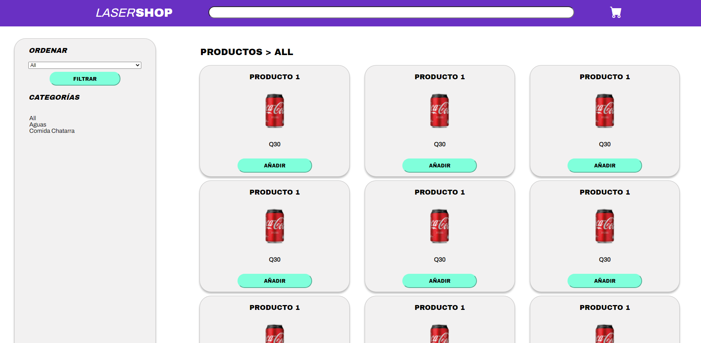

# Capacitación React - NodeJS de Laserants
## Ricardo Antonio Menéndez Tobías

----------
- ### [Pagina Github Pages](https://richimenendez.github.io/proyecto-capacitacion-laserants/)
- ### [Diseño en Figma](https://www.figma.com/file/aVwRUyBX798SULjbX8APUH/Capacitaci%C3%B3n?node-id=0%3A1)
  - Dentro de FIGMA se encuentra un maquetado general de los colores y estrucutra que quiero que tenga la página. No es un diseño final.
- ### Fase 1: 
  - En la fase 1, se encuentra todo el trabajo realizado en el HTML basico y css sin frameworks para hacer el maquetado inicial de la aplicación. Esta cuenta de 3 páginas, la página de productos (la inicial), la página de un producto individual y el carrito. Se puede acceder a ellos por medio del navbar (los productos solo haciendo click en ellos desde la página de productos).

----------
- #### Imagenes de Figma

----------
- #### Imagenes de Fase 1

